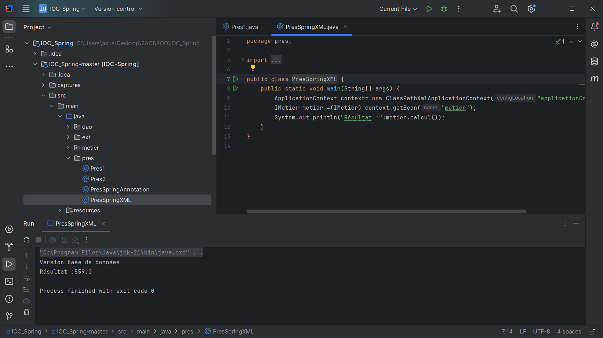
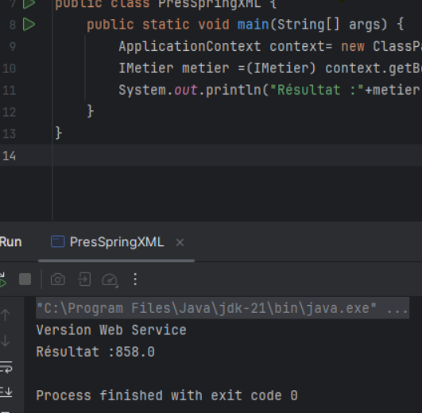
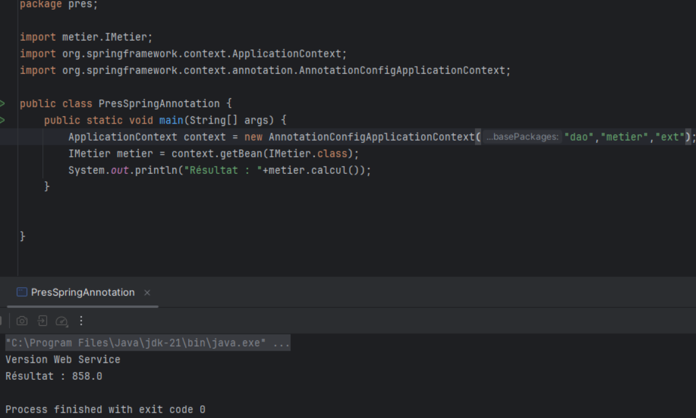

<h1>Injection des dépendances avec Spring</h1>
<h2> Diagramme de classes : </h2>

<h2>XML</h2>
<h3>Version base de données :</h3>

<h3>Version web service :</h3>

<h2>Annotations</h2>
<h3>Version base de données :</h3>

<h3>Version web service :</h3>
