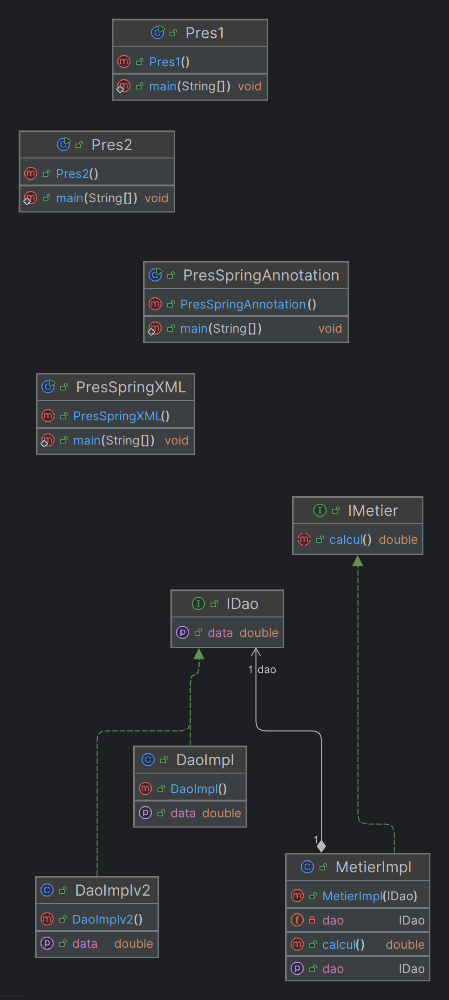
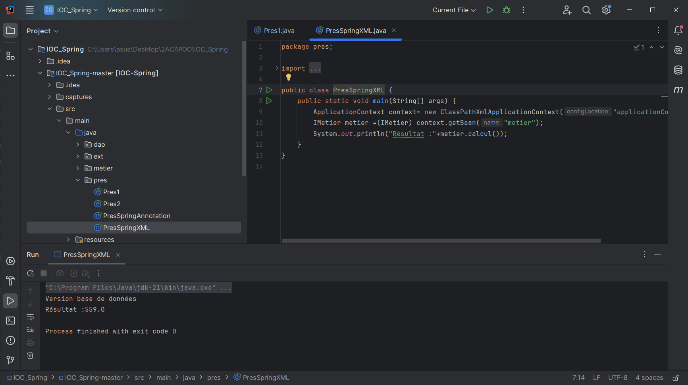
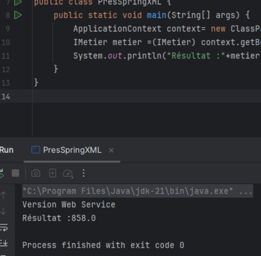
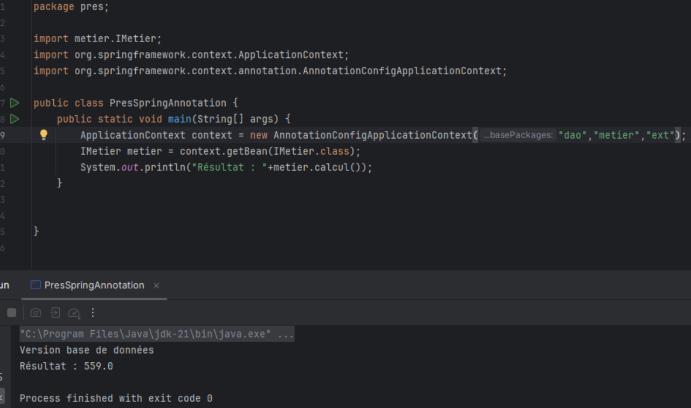
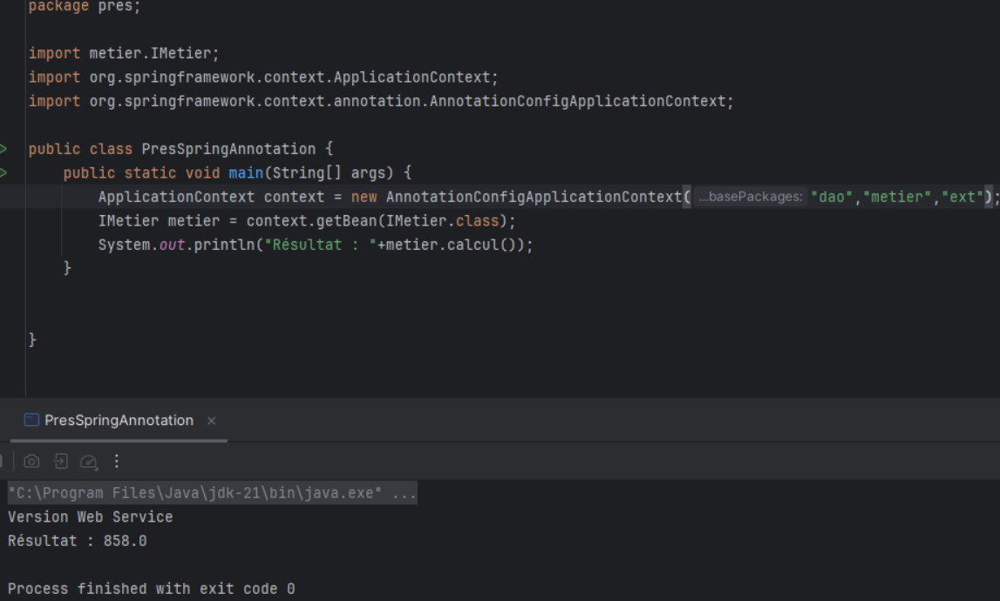

# Injection des dépendances avec Spring

Ce projet explore l'utilisation de l'injection des dépendances (Dependency Injection) avec le framework **Spring**. Il démontre différentes approches d'injection (via XML et annotations) pour connecter les composants de l'application dans deux contextes distincts : une base de données et un web service.

---

## Table des matières

1. [Description du projet](#description-du-projet)
2. [Technologies utilisées](#technologies-utilisées)
3. [Captures d'écran](#captures-décran)
   - [Diagramme de classes](#diagramme-de-classes)
   - [Injection via XML](#injection-via-xml)
     - [Version base de données](#version-base-de-données---xml)
     - [Version web service](#version-web-service---xml)
   - [Injection via annotations](#injection-via-annotations)
     - [Version base de données](#version-base-de-données---annotations)
     - [Version web service](#version-web-service---annotations)
4. [Instructions pour l'exécution](#instructions-pour-lexécution)
5. [Auteur](#auteur)

---

## Description du projet

L'objectif principal de ce projet est d'illustrer comment **Spring** permet de réaliser une injection des dépendances pour découpler les différentes couches et composants d'une application. Deux approches sont présentées :
1. **Configuration XML** pour définir les dépendances dans des fichiers de configuration.
2. **Annotations** pour configurer les dépendances directement dans le code avec des métadonnées.

Les scénarios couverts :
- Connexion à une base de données.
- Communication avec un web service.

---

## Technologies utilisées

- **Framework Backend :** Spring Framework
- **Injection des dépendances :** XML et annotations
- **Langage :** Java

---

## Captures d'écran

### Diagramme de classes
Le diagramme suivant illustre la structure des classes et les relations entre elles dans le cadre de l'injection des dépendances.

---

### Injection via XML

#### Version base de données
Cette capture montre la configuration XML utilisée pour injecter des dépendances dans le contexte d'une base de données.

#### Version web service
Cette capture montre la configuration XML utilisée pour injecter des dépendances dans le contexte d'un web service.

---

### Injection via annotations

#### Version base de données
Cette capture montre l'utilisation des annotations pour injecter des dépendances dans le contexte d'une base de données.

#### Version web service
Cette capture montre l'utilisation des annotations pour injecter des dépendances dans le contexte d'un web service.

---

## Auteur
Mohamed Amine RIZKI
